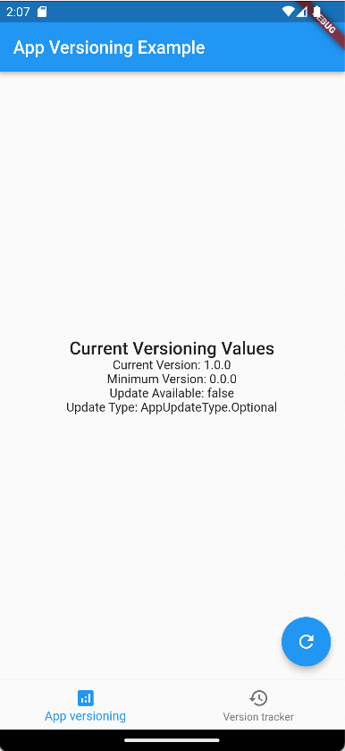
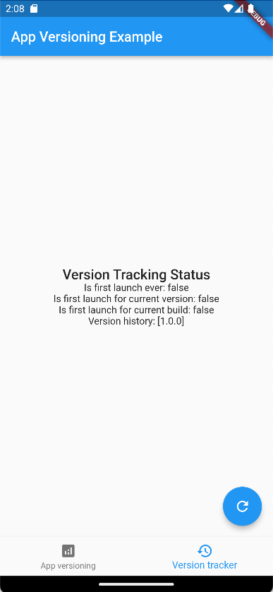

# App Versioning

Prompt users to update the app whenever there are new optional or mandatory updates available.

<p align="center">
  
&nbsp; &nbsp; &nbsp; &nbsp;
  
</p>

## Overview

This packages provides a simple yet customisable way to suggest or force updates to Android & iOS apps
It is built on top of the [in_app_update](https://pub.dev/packages/in_app_update) package for Android and [upgrader](https://pub.dev/packages/upgrader) for iOS.

## Features

- Retrieve information about available updates from the Play Store or App Store.
- Version bomb. Force users to update the app if the update is mandatory by configuring a minimum version using your custom Backend or [Firebase Remote Config](https://firebase.google.com/docs/remote-config).
- Launch Android updates using the native [In-App Updates](https://developer.android.com/guide/playcore/in-app-updates) flows, supporting flexible and immediate updates.
- Request iOS updates by redirecting to the App Store.
- Track version update history using the [Version Tracker](https://pub.dev/packages/version_tracker).

## Get Started

View the [example project](/example/lib/) for a complete working example.

### Initializing

1. Initialize the `AppVersioning` class with your app's identifiers and minimum version provider.
    - The minimum version provider can be an `apiService` from your backend, a `firebaseService` from your remote config or a `customService` that you implement.

    ```dart
    final appVersioning = AppVersioning.apiService(
        apiConfig: ApiConfig(
            endpoints: ApiVersioningEndpoints(
            "https://api.example.org",
            minimumVersioningEndpoint: "api/api-compatibility",
            ),
        ),
        updateConfig: UpdateConfig(
            appStoreAppId: "1234567890",
            playStoreAppId: "org.example.versioning",
            appstoreCountryCode: "US",
        ),
        );
    ```

2. Track the current version when the app is launched.

    ```dart
    await appVersioning.tracker.track();
    ```

3. Check whether a new update is available.

    ```dart
    final appUpdateInfo = await appVersioning.getAppUpdateInfo();
    ```

4. If an update is available, prompt the user to update the app using your own UI elements.

    ```dart
    if (appUpdateInfo.isUpdateAvailable) {
      _showUpdatePopup(appUpdateInfo.updateType == AppUpdateType.Mandatory);
    }
    ```

5. If the user accepts the update, or the update is mandatory, launch the update flow.

    ```dart
    appVersioning.launchUpdate(updateInBackground: !isMandatory)
    ```

### Backend Services

Apps using a version below the minimum version will be forced to update with a mandatory update type.
This plugin currently supports 2 different backends to set the minimum version supported on the app.

1. **API**: An arbitrary URL endpoint that returns the minimum versions JSON.
2. **Firebase Remote Config**: Key/value pairs with the minimum versions specified on Firebase.
    > This requires the project to include and set up Firebase separately.

## Contributing

Contributions are most welcome! Feel free to open a new issue or pull request to make this project better.

### Deployment

1. Set the new version on the [pubspec.yaml](pubspec.yaml) `version` field.
2. Update the [CHANGELOG.md](CHANGELOG.md) file documenting the changes.
3. Update the [README.md](README.md) file if necessary.
4. Run `dart doc` to update the documentation.
5. Run `dart pub publish --dry-run` to ensure the package can be published successfully.
6. Create a new tag with the release version `git tag -a x.y.z -m "x.y.z" && git push --tags`.
7. Navigate to [GitHub Releases](https://github.com/levin-riegner/lr-app-versioning/releases) and create a new release for the previously created tag, including the [CHANGELOG.md](CHANGELOG.md) changes.
8. Finally run `dart pub publish` to deploy the project.

## Credits

- [upgrader](https://pub.dev/packages/upgrader) - Copyright (c) 2018-2022, Larry Aasen [MIT License](https://pub.dev/packages/upgrader/license) for providing the iOS update mechanisms.
- [in_app_update](https://pub.dev/packages/in_app_update) - Copyright (c) 2020 Victor Choueiri [MIT License](https://pub.dev/packages/in_app_update/license) for providing the Android update mechanisms.
- [version_tracker](https://pub.dev/packages/version_tracker) - Copyright (c) 2021 Kevin Morelli [MIT License](https://pub.dev/packages/version_tracker/license) for providing the code to track version accross updates.

## License

This repo is covered under the [MIT License](LICENSE).
